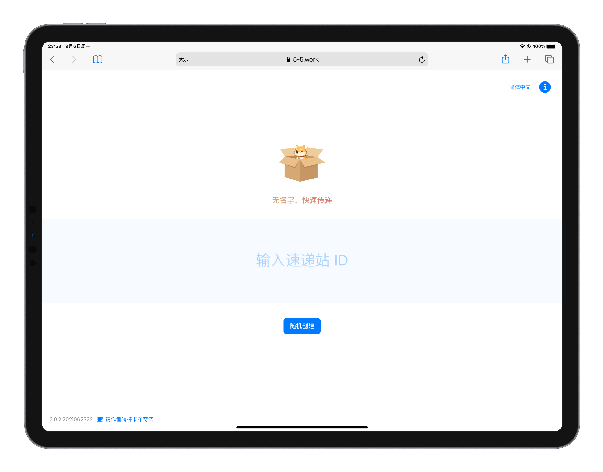
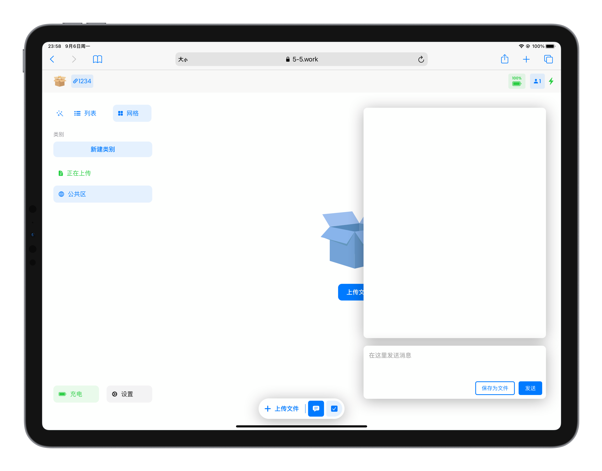
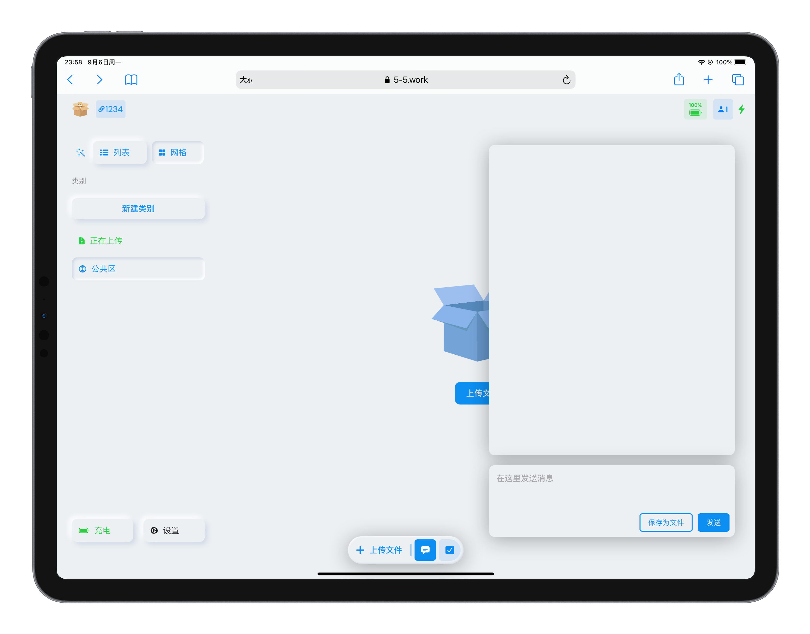
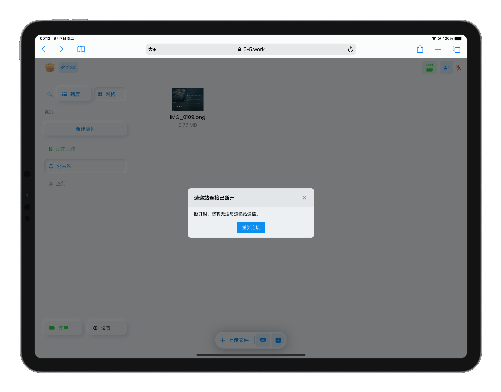

我们在 2021 年 6 月发布了 [无名速递](https://5-5.work)（原名「五号电池」）的 2.0 版本，今天使用 iPad Pro 体验了一下。

打开网页

创建房间，名为 1234

点击魔法棒可以切换主题

点击左上角的链接可以弹出房间二维码，即当前房间的链接


<video controls width=100%>
    <source src="assets/qrcode.mov">
</video>


可以使用消息框在房间内发消息，其他人也可以看到


<video controls width=100%>
    <source src="assets/message.MP4" type="video/mp4">
</video>


在 iPad 上 drag & drop 一张照片可以上传至房间


<video controls width=100%>
    <source src="assets/add1photo.MP4" type="video/mp4">
</video>


左上角点击切换布局：列表和网格


<video controls width=100%>
    <source src="assets/layout.MP4" type="video/mp4">
</video>


为房间购买电池，免费房间的文件可以存储一周


<video controls width=100%>
    <source src="assets/payment.MP4" type="video/mp4">
</video>


drag & drop 多张照片


<video controls width=100%>
    <source src="assets/add_photos.MP4" type="video/mp4">
</video>


新建类别


<video controls width=100%>
    <source src="assets/add_category.MP4" type="video/mp4">
</video>


多选 & 移动文件到新类别


<video controls width=100%>
    <source src="assets/add_photos.MP4" type="video/mp4">
</video>


断开连接时，会有弹框提醒已断开

