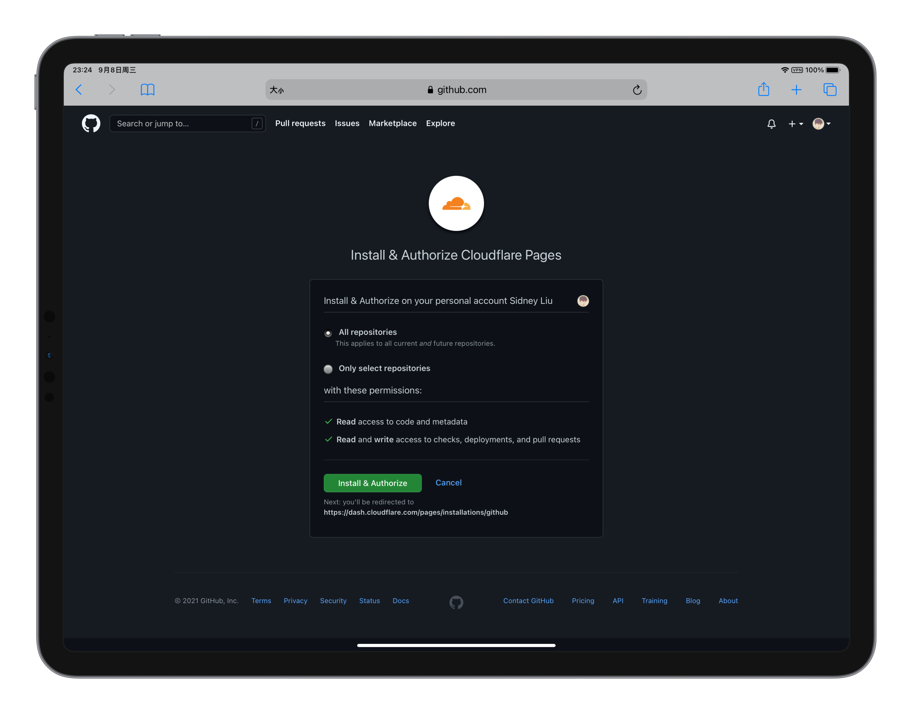
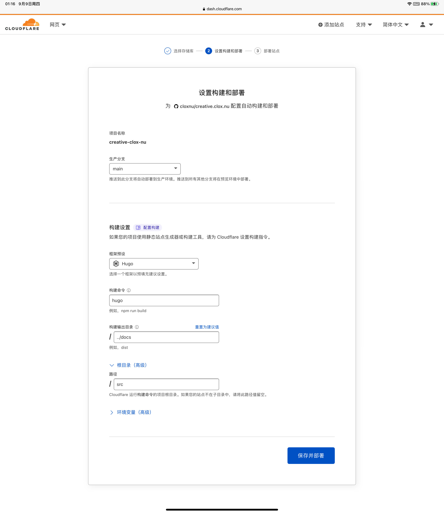
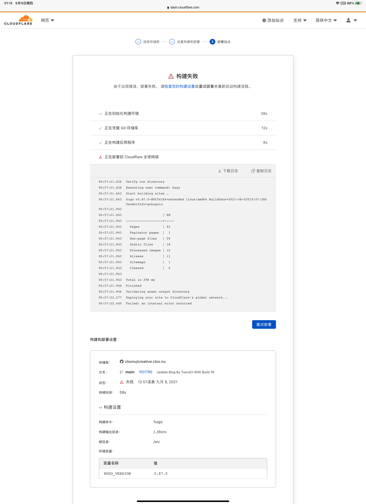

[Cloudflare Pages](https://pages.cloudflare.com) 是一个 Cloudflare 于 2020 年末推出的 [Jamstack](https://jamstack.org) 平台。**JAMstack** 指主要使用 Javascript, API, Markup 的一种安全快速的网站结构。

在此之前，这个 Hugo 站点是使用 GitHub Pages + Cloudflare CDN 这种方式运作的。于是今天尝试使用 Cloudflare Pages 部署。

进入官网之后，登录 -> GitHub 授权




由于 Cloudflare Pages 是直接支持了 Hugo，配置阶段简单快速。

第一次构建失败，日志反映出 theme 内部的 html template 编译错误。

然后我尝试了指定几个 Hugo 版本，但是最终仍然失败，从日志中看到构建已经成功了，但是部署错误，以收到这条错误告终：

```
Failed: an internal error occurred
```



