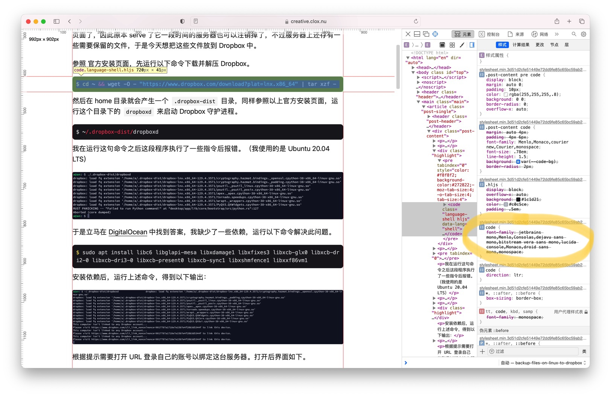

今天我把此 Hugo 站点关于 `code` 部分的字体改为 Jetbrains Mono，大致进行了以下几步。

我使用的是 Papermod 主题，其 [Wiki](https://github.com/adityatelange/hugo-PaperMod/wiki/FAQs#bundling-custom-css-with-themes-assets) 页面有讲述关于如何加入自定义 css 的方法。

于是我尝试将用 jsDelivr 加速的 Jetbrains Mono 字体静态加载[^1]并生效于 `code` 中。

发布后，网站上并没有生效。

进行网页检查后发现，一般的 code 块 css 选择器是 `.post-content code` 而我这里只用了 `code`，因此我的 `font-family` 属性优先级太低了。

因此解决方式就是在 `font-family` 后增加 `!important`，或把自定义的 css 的选择器也改为 `.post-content code` 即可解决问题。

[^1]: https://gist.github.com/Albert221/753d7f8955eeb6f5e50486fce048e39f