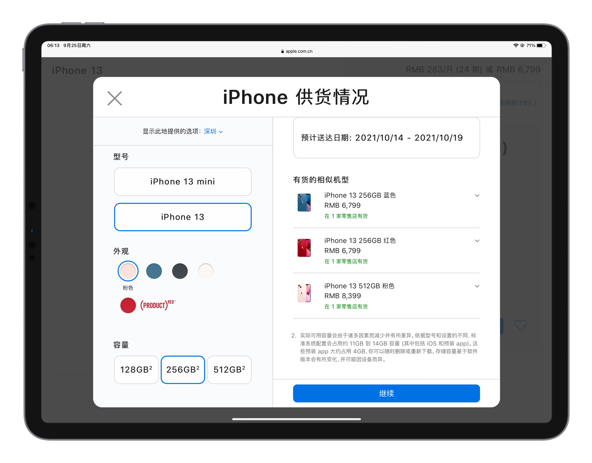

9 月 17 号那天，我拿到了等了很久的相机，也恰好是那天的前一天，我的 iPhone XR 坏掉了，连 MacBook 恢复模式都一直自己重启。iPhone 13 也恰好在这一天晚上 8 点开售，可是在这天我还没想好要换手机。

24 号，iPhone 13 开卖了，我才了解到 24-26 号 Apple Store 是只对预约的人开放的，同时这段时间我也意识到 24 号之前在 Apple Store App 里下单是没法选线下取货的（应该是 17 号晚上 8 点把名额抢完了），送货的话要等很久。所以工作人员让我留意一下抢 27 号及以后的线下取货。当时的截图是这样的：

24 号白天的时候，发现官网的某一页有这么一句话「预约系统的开放时间为每天上午 上午 6:00」。好了，定好闹钟，25 号早上 6 点抢。

结果早上 6 点的时候，线下取货最开始确实只能选 27 号取货，可是我最想选的 256GB 粉色刚好没有了。在我正纠结颜色的时候，突然取货时间可以选 25 号了。

最后从纠结的 512GB 粉改为了 256GB 蓝，预约了 25 号下午 3 点取货。

那天下午，到 Apple Store 的时候，在离店很远的地方就需要出示预约二维码，通过一个用围栏围成的长长的过道，才能进入 Apple Store。

进入之后，在一位工作人员的处理下，很快就拿到了 iPhone 13，由于这种特殊的「限流」处理，店内出现了罕见的「工作人员比顾客多」的特殊现象。

当时还玩了玩其他设备，mini 是真的小巧

这个暗夜色还有一丝丝深蓝色，挺好看的

然后我就开始现场开箱了

最后，试了下 iPhone 13 Pro 的微距和电影效果模式

