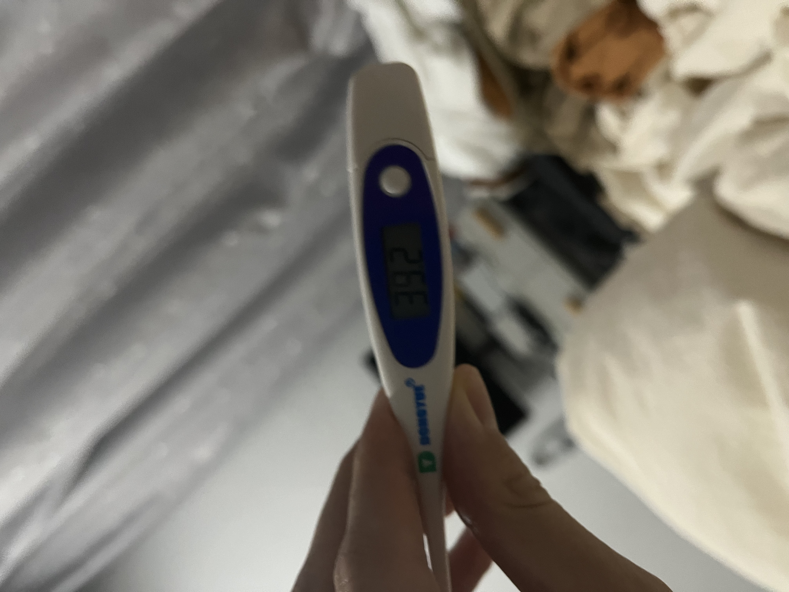

最近几天发生了两件大事儿，正巧不巧都发生在世界杯决赛的那天。

梅西夺冠真的很激动，可是看完点球大战根本激动不起来。

咋回事儿呢？因为我正发着烧。

这事儿还得从早上说起。

天还没亮，身上打了个寒颤，没感觉有多冷吧，就是止不住的哆嗦。再加上头天嗓子有点痒，于是用抗原测了一下。

果然阳了！

我不知道是不是该庆祝。

我还没有意识到问题的严重性，拍了个照然后又睡了。

当我再次醒来时，已经毫无胃口并且开始发烧了。

第一天还只烧到 38.5 度左右，基本每到饭点就吃两颗布洛芬，过一两个小时总能退烧。

于是我非常放心的看了世界杯。

这次的决赛真的相当好看了，阿根廷已经非常出色了，可是下半场明显看出来这些老球员都跑不动了，法国换上来的几个年轻小伙子气势咄咄逼人。

阿根廷辛辛苦苦建立的优势 2 度被姆巴佩扳平。于是进入点球大战。

恭喜阿根廷夺冠，比赛结束之后所有平台都被梅西刷屏了，姆巴佩的帽子戏法貌似被遗忘了。

球看完了，测了下体温，39.2

吃了布洛芬马上睡了。

第二天又是这样，每隔几个小时就烧一次。

这两天吃了 10 颗布洛芬。

好在第三天不再发烧，到写这篇文章为止。

目前基本就只有嗓子痒这个症状了，不知道接下来还要康复多久。
