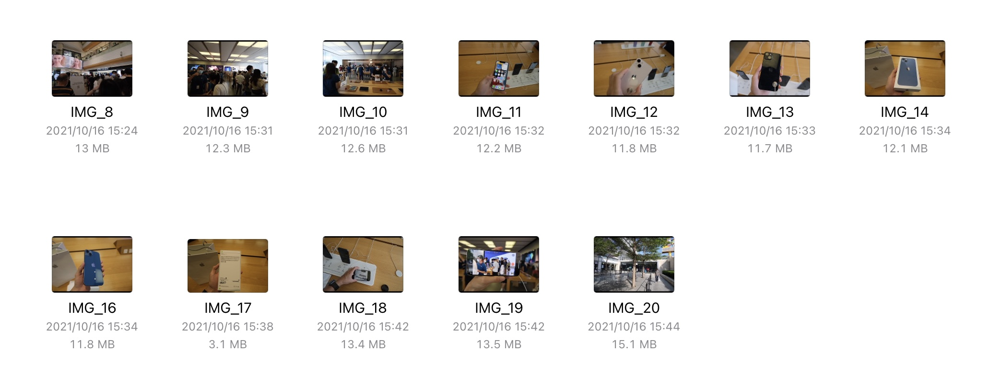

从写好第一篇多图大图的 blog 那一刻起，我就一直在思考访问者如何快速加载这些图片提高阅读体验，因为这些图片动辄几兆甚至几十兆，而我又不希望压缩这些图片导致质量下降。

所以在以往的多图 blog 中，访问者往往要等待很久的加载时间。



既然是图片大小导致的「硬伤」，加载这些图片几乎都取决于访问者的网速，那么有没有办法从图片本身的角度出发，来优化这种加载时间？

## 什么是渐进式 JPEG（Progressive JPEG）

我们知道，JPEG 格式是目前兼容性最高，使用范围最广的图片有损压缩格式。而其中的编码方式分为多种，这里主要讨论两种：**Baseline JPEG** 和 **Progressive JPEG**。

对于 **Baseline JPEG**，图片是从上到下一行行顺序存储的，因此在加载图片的时候能看到图片从上到下慢慢显现出来。


而 **Progressive JPEG**，图片会由模糊到清晰渐进式地分多次存储，因此在加载图片时看到的图片是由模糊到清晰渲染的。


> 图片来自「简书」

这种渐进式 JPEG 显然可以在图片未加载完全的时候就能看到它的「预览」，而且渐进式 JPEG 的文件大小要略小于 Baseline JPEG。不过渐进式 JPEG 在 Windows 7 以前的 IE 等浏览器不受支持，会在完全加载完成后才显示图片。

目前多图 blog 之所以加载时间很长，是因为这些图片存储的编码方式都是 Baseline JPEG。

## 🎬

于是，我在之前的 GitHub Actions 配置文件中补充了将这些图片转换为 Progressive JPEG 的命令，当前的 blog 在合并入主干分支后 GitHub Actions 会先使用 hugo 命令创建 HTML[^1]，然后 Progressive JPEG 命令再将所有 JPEG 图片批量处理。

在 Linux 中，使用 [ImageMagick](https://imagemagick.org/script/index.php) 处理图片。其中的 [-interlace](https://imagemagick.org/script/command-line-options.php#interlace) 选项有提供将图片转换为 Progressive JPEG。

起初我使用命令

```shell
$ mogrify -verbose -interlace plane **/*.jpg
```

匹配并转换目录下所有后缀为 .jpg 文件并转换为渐进式 JPEG，在我的 macOS Big Sur 中可以正常工作，但是在 GitHub Actions 运行后报错：

```
mogrify-im6.q16: unable to open image `**/*.jpg': No such file or directory @ error/blob.c/OpenBlob/2874.
```

于是我换了一种思路，可以用 `find` 命令先找到所有 JPEG 图片，然后再处理，这行命令就变成了

```shell
$ find . -type f -exec file --mime-type {} \; | awk -F ': ' '{if ($NF == "image/jpeg") print $1 }' | xargs mogrify -verbose -interlace plane
```

运行后的多图 blog 体验效果：（无本地缓存）


<video controls width=100%>
    <source src="assets/video.mov" type="video/mov">
</video>


## 值得优化的地方

- 可以不需要每次都转换所有图片，根据 `hugo` 命令生成的 HTML 与上一次的 HTML 的 diff，从而转换修改、添加和删去的图片。
- 安装 ImageMagick 需要一部分时间，可以尝试用 Docker 容器取代。


[^1]: [用 GitHub Actions 生成 blog 的 HTML 到 gh-pages 分支](/news/2021/10/25/gh-pages/)