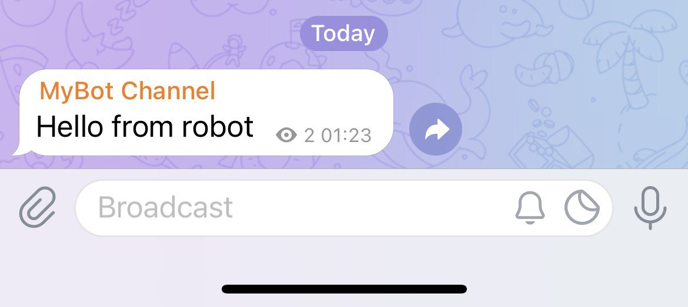

Telegram Bot，简而言之就是运行在 Telegram 上的可交互的「机器人」，你可以给它发送指令让它完成操作或是实现一些功能（付钱、游戏等等），或者可以在 Channel 或 Group 中发送特定消息。

这是 [官方介绍](https://core.telegram.org/bots)。它的主要原理就是开发者通过调用 [Telegram Bot API](https://core.telegram.org/bots/api) 来实现接收指令、发消息以及实现各种功能。

## 注册

1. 与 [@BotFather](https://t.me/BotFather) 对话，发送指令 `/start` 开始，`/newbot` 申请一个新的 Bot 账号。


2. 接着，BotFather 会要求你输入这个 Bot 的名字和 ID。创建完成后，BotFather 会同时给你一个 token，记住这个 token。


3. 此时，已经可以和这个 Bot 互动了，但是想要这个 Bot 也可以主动发消息，这时就要建立一个 Channel，并把这个 Bot 设置为管理员。这个 Channel 如果是 public，其链接可以自定义。这里以 private 为例。


4. 由于 Channel 是 private，我们需要这个 Channel 的 ID 来操作，这里可以通过将 Channel 内的消息转发给 [@JsonDumpBot](https://t.me/JsonDumpBot) 来查看。可以看到此 Channel 的 ID 是 `-1001790411176`。


## 发消息

在官方文档的 [Making requests](https://core.telegram.org/bots/api#making-requests) 介绍中讲到，可以使用 GET 或 POST 请求以下 URL。

```
https://api.telegram.org/bot<token>/METHOD_NAME
```

同样在官方文档 [sendMessage](https://core.telegram.org/bots/api#sendmessage) 介绍中，列出了所有参数列表。在获取到 token 和 Channel ID 后，以下这条链接就是此 Bot 发给刚刚建立的 Channel 一条消息「Hello from robot」的请求。

```
https://api.telegram.org/bot2110628450:AAHQ78uj42ddtdsx0gKfaZGyFUhpnQ13vyM/sendMessage?chat_id=-1001790411176&text=Hello%20from%20robot
```



我们也可以编写以下 Python 程序，运行之后 Bot 同样会在此 Channel 发送一条信息「Hello from robot」。（在此之前需要安装 telegram 依赖 `pip install python-telegram-bot`）[^1]

```py
import telegram

bot = telegram.Bot(token='2110628450:AAHQ78uj42ddtdsx0gKfaZGyFUhpnQ13vyM')
print(bot.get_me())

bot.send_message(text="Hello from robot", chat_id=-1001790411176)
```

[python-telegram-bot 官方文档](https://python-telegram-bot.readthedocs.io/en/stable/)

## 下一步...

[Telegram Bot 简明教程 II - 收指令与指令键盘](../brief-tutorial-on-telegram-bot-ii/)


[^1]: https://github.com/python-telegram-bot/python-telegram-bot