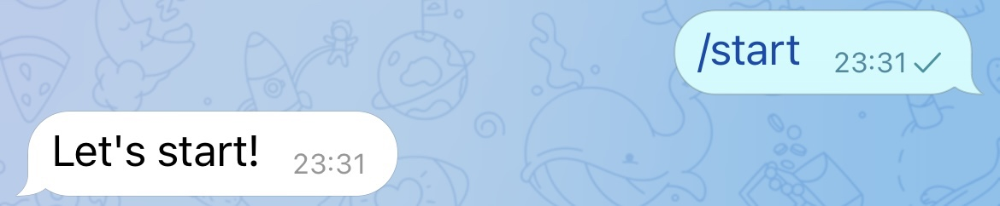
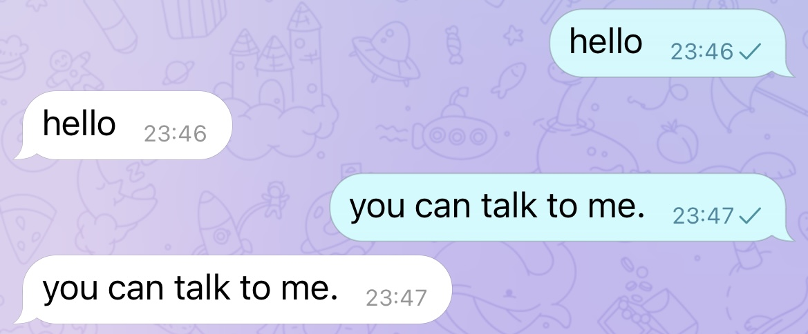
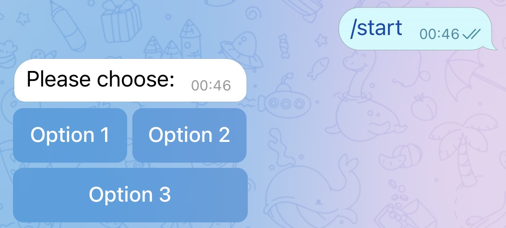
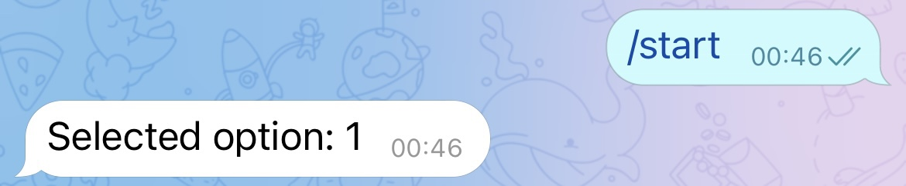

## 在此之前

[Telegram Bot 简明教程 I - 注册与发消息](../brief-tutorial-on-telegram-bot-i/)

## 收指令

[python-telegram-bot wiki 页面](https://github.com/python-telegram-bot/python-telegram-bot/wiki/Extensions-%E2%80%93-Your-first-Bot) 介绍了如何使用 Python 脚本实现与 Bot 交互。

以下是根据这个 wiki 页面编写的例程。

### 接收 `/start` 指令

```py
from telegram import Update
from telegram.ext import Updater, CallbackContext, CommandHandler

token = '2110628450:AAHQ78uj42ddtdsx0gKfaZGyFUhpnQ13vyM'


def start(update: Update, context: CallbackContext):
    context.bot.send_message(chat_id=update.effective_chat.id, text="Let's start!")
    # 或
    # update.message.reply_text("Let's start!")


if __name__ == '__main__':
    updater = Updater(token=token, use_context=True) #1
    start_handler = CommandHandler('start', start) #2
    updater.dispatcher.add_handler(start_handler) #3
    updater.start_polling() #4
    updater.idle() #5
```

1. 首先根据 token 创建一个 `updater` 对象；
2. 定义 `start` 函数，在函数体中实现给发指令的那个 `chat_id` 发送消息「Let's start!」，并将这个函数与 `start` 指令关联；
3. 将 `start` 函数作为 `CommandHandler` 添加到 `update.dispatcher` 中；
4. 当前设定的指令开始运作，程序会自动持续地向 Telegram 的服务器发送请求，以实时接收指令；
5. 等待用户 Control-C 或者进程杀死。

运行此程序，并与 Bot 对话，执行指令 `/start` ，结果如下：



### 对话

```py
from telegram import Update
from telegram.ext import Updater, CallbackContext, CommandHandler, MessageHandler, Filters

token = '2110628450:AAHQ78uj42ddtdsx0gKfaZGyFUhpnQ13vyM'


def echo(update: Update, context: CallbackContext):
    context.bot.send_message(chat_id=update.effective_chat.id, text=update.message.text)
    

if __name__ == '__main__':
    updater = Updater(token=token, use_context=True)
    echo_handler = MessageHandler(Filters.text & (~Filters.command), echo) #1
    updater.dispatcher.add_handler(echo_handler) #2
    updater.start_polling()
    updater.idle()
```

将之前的代码稍作修改：

1. 将之前的 `start` 函数改为 `echo` 函数，其作用是将发给 Bot 的消息发送回来，并将之前的 `CommandHandler` 改为 `MessageHandler`，这里 `Filter` 的作用是过滤文本和非指令信息；
2. 添加到 `dispatcher` 中。

运行此程序，并与 Bot 对话，Bot 会将原话发送回来：



### 指令键盘

关于这一部分，python-telegram-bot 有一个 [例程](https://github.com/python-telegram-bot/python-telegram-bot/blob/master/examples/inlinekeyboard.py)，和对应的 [wiki](https://github.com/python-telegram-bot/python-telegram-bot/wiki/InlineKeyboard-Example)。

```py
from telegram import InlineKeyboardButton, InlineKeyboardMarkup, Update
from telegram.ext import Updater, CallbackContext, CommandHandler, CallbackQueryHandler

def start(update: Update, context: CallbackContext):
    keyboard = [
        [
            InlineKeyboardButton("Option 1", callback_data='1'),
            InlineKeyboardButton("Option 2", callback_data='2'),
        ],
        [
            InlineKeyboardButton("Option 3", callback_data='3'),
        ]
    ] #1
    reply_markup = InlineKeyboardMarkup(keyboard) #2
    update.message.reply_text("Please choose:", reply_markup=reply_markup) #3


def keyboard_callback(update: Update, context: CallbackContext): #4
    query = update.callback_query #5
    query.answer() #6
    query.edit_message_text(text=f"Selected option: {query.data}") #7
    
if name == '__main__':
    updater = Updater(token=token, use_context=True)
    start_handler = CommandHandler('start', start)
    updater.dispatcher.add_handler(start_handler)
    updater.dispatcher.add_handler(CallbackQueryHandler(keyboard_callback)) #8
    updater.start_polling()
    updater.idle()
```

1. 同样回到 `start` 函数，这次我们更改下 `/start` 指令内部逻辑，一开始定义了一个二维数组，我们可以简单地理解为定义了两排按钮，第一排是 `Option 1` 和 `Option 2`，第二排是 `Option 3`；
2. 将其转换为 `InlineKeyboardMarkup` 类型以便发送；
3. 将这个指令键盘作为回复发送；
4. 定义一个新的函数，作为用户按键盘后的 handler；
5. 当用户点击按钮，`update.callback_query` 中拥有此指令信息，将其定义为 `query`；
6. 调用 `query` 的 `answer()` 方法，即告诉用户「回复」了这条指令，表现为客户端不再显示等待这条指令的 UI；
7. 将用户选择的值作为一条消息覆盖原来的键盘消息；
8. 将此 handler 加入 `dispatcher`。

运行此程序，并与 Bot 对话，执行指令 `/start` ，结果如下：



当点选 "Option 1" 后，出现 Loading 的提示后，原消息更改为以下结果：



## 下一步...

未完待续

