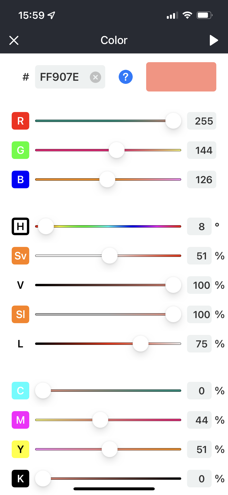
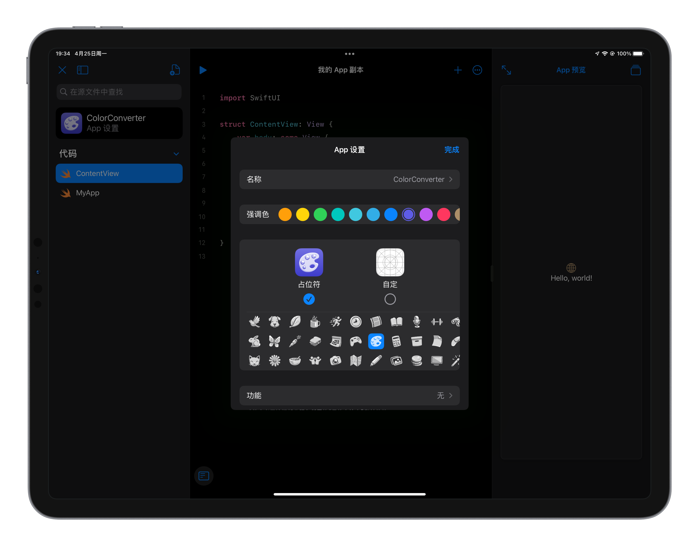

> 这是一款很随意的 app，但这也是一款可以用 iPad 制作出来并可维护的 app。

[链接在这里](https://apps.apple.com/app/palette-color-conversion/id1623551390)

## 楔子

当我第一次吃惊地发现 iPad 居然可以用 Playground 写一个 app 并上架到 App Store 时，于是脑海里瞬间浮现出无数个想法，然后立马去试试。

那时我完全没有接触过 SwiftUI，但是在我尝试试着在 iPad 上写一些代码时，借助 Playground 里的 code snippet，我竟发现 SwiftUI 原来现在已经发展到可以如此便捷高效地构建一个 app。

然后我就决定写一个颜色转换再加上可以配色的超简洁的 app。

说起颜色转换，我不止一次开发跟颜色相关的项目，上次是在钟大的 JSBox 里写了一个颜色转换的 script。

几年前，我曾做过一个叫「今天的颜色」的 app，它的功能非常简单，就是生成一个颜色，每天一个不同的颜色，同时还会把 logo 改成当天的颜色。却也是因为功能太简单，被 App Store 拒绝上架。时到今日，today's color 的 block 在这个 app 会在未来某个版本安排一下～纪念一下。

## Just Do It

4 月末，我开始了这个项目，经历了十几个版本的测试，也就大概十几天，上架了 App Store，在前几天还因为 App Store Connect 的服务不稳定稍稍拖慢上架速度。

在 iPad 上开发过程中，还是给了我以下几点不方便的因素：

- 难以调试，只允许做一个非常简单的项目，一旦复杂起来遇到不好解决的 bug 就得去 mac 上调试
- 搜索功能不够强大
- 性能不够，遇到较复杂的语句就无法编译，有时候会导致整个 Playground 卡住（可能是 bug）（就算是 M1 的 iPad 也性能不够，跟 mac 上的 M1 应该是缩水了的）
- 无法做本地化
- 等等...

iPad 上开发 app 还有许多需要改善的地方，但这样的思路的确是一个相当好的思路，试想一下如果未来的 iPad 可以允许我们每个人轻松做一个游戏然后上架，每个人都可以把自己的想象发挥到极致而无需担心实现的难度，Apple 官方提供一套无版权的人物角色模型，类似现在的 SF Symbol。下一个时代是人人创作者的时代。

## 预告一下

未来，这些调颜色的 block，还会新增配色，色相环等等，敬请期待～