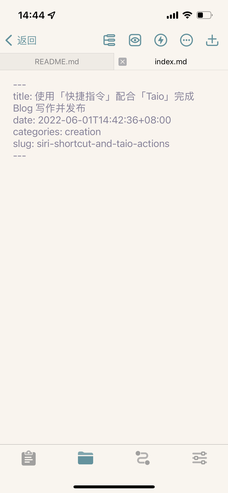

可能是 Blog 发布流程太长太麻烦，导致我总是不太经常写 Blog，但这次我发现「快捷指令」可以把「Working Copy」的 Commit、Push、Pull 等操作集成起来，而且也可以使用 Taio 动作，于是行动起来。

在 Taio 动作中我写了两个动作，分别是创建 Post 和创建 News，在运行这个快捷指令时可以选择创建 News 还是 Post，如果是 Post，那还需要选择类别，类别列表通过「Taio」的获取目录可以获得现有的类别，否则也可以新建类别。

创建 Post 的动作可以接受一个输入参数，即类别。

这个打开链接就是打开根目录的 `README.md` 文件，后面的文件指令才能找到正确的路径。

## 运行

大功告成～ 剩下就是发 Blog 然后等着 GitHub Actions 去处理啦

把这几个 Blog 操作合成一个小组件，简单易用～

