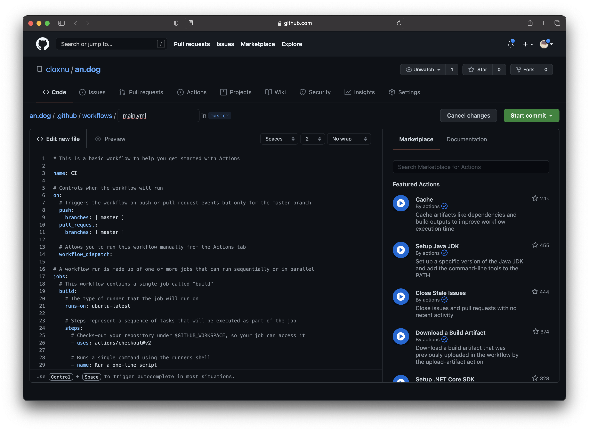

前情提要：在我的 travel blog 的仓库根目录下，有一个叫 `gotravel` 的文件，运行该文件即可自动生成网站，因此 GitHub Actions 只需要在我每次 push 之后运行这个文件再提交一次就可以了。

在 GitHub 仓库内点击菜单栏的 Actions，然后选择 set up a workflow yourself


然后就会跳转至新建文件页面，以及 GitHub 自动生成最初的 `main.yml` 文件。



```yaml
# This is a basic workflow to help you get started with Actions

name: CI

# Controls when the workflow will run
on:
  # Triggers the workflow on push or pull request events but only for the master branch
  push:
    branches: [ master ]
  pull_request:
    branches: [ master ]

  # Allows you to run this workflow manually from the Actions tab
  workflow_dispatch:

# A workflow run is made up of one or more jobs that can run sequentially or in parallel
jobs:
  # This workflow contains a single job called "build"
  build:
    # The type of runner that the job will run on
    runs-on: ubuntu-latest

    # Steps represent a sequence of tasks that will be executed as part of the job
    steps:
      # Checks-out your repository under $GITHUB_WORKSPACE, so your job can access it
      - uses: actions/checkout@v2

      # Runs a single command using the runners shell
      - name: Run a one-line script
        run: echo Hello, world!

      # Runs a set of commands using the runners shell
      - name: Run a multi-line script
        run: |
          echo Add other actions to build,
          echo test, and deploy your project.

```

修改为：（这里使用了 `actions-js/push@master` 来 Commit & Push）

```yaml
# This is a basic workflow to help you get started with Actions

name: CI

# Controls when the workflow will run
on:
  # Triggers the workflow on push or pull request events but only for the master branch
  push:
    branches: [ master ]
  pull_request:
    branches: [ master ]

  # Allows you to run this workflow manually from the Actions tab
  workflow_dispatch:

# A workflow run is made up of one or more jobs that can run sequentially or in parallel
jobs:
  # This workflow contains a single job called "build"
  build:
    # The type of runner that the job will run on
    runs-on: ubuntu-latest

    # Steps represent a sequence of tasks that will be executed as part of the job
    steps:
      # Checks-out your repository under $GITHUB_WORKSPACE, so your job can access it
      - uses: actions/checkout@v2
      
      # Generate website
      - name: Run generator
        run: gotravel_linux_arm64
        
      # Commit & Push
      - name: Commit & Push changes
        uses: actions-js/push@master
        with:
          github_token: ${{ secrets.GITHUB_TOKEN }}
          branch: master

```

最终 build success：

