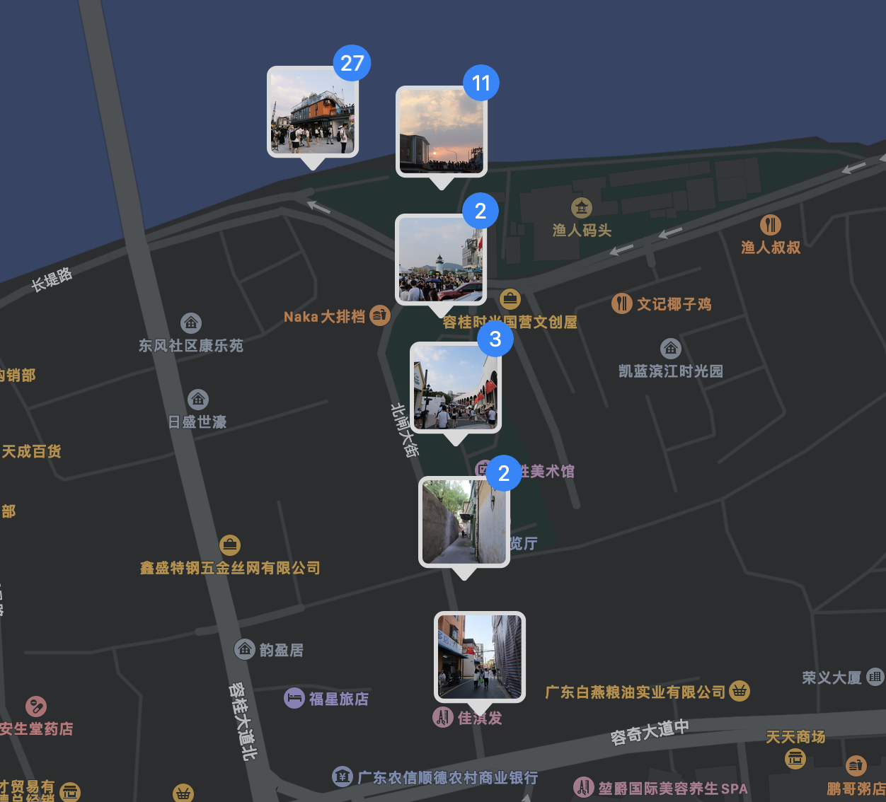

## 🤔

当我们使用手机拍照时，按下快门的那一刻，程序会自动获取当前地理位置，并将其写入照片中。而当我们拥有海量包含地理位置并通过 iCloud 或者 NAS 管理的照片时，这些照片会被程序自动归类，因此可以省去大量整理照片的时间。

可是当拍照的设备转移到成像质量更好的相机时，我们却很难方便地获取地理位置信息，因为现在大多数的单反/无反相机都不带有 GPS 模块。因此目前这些相机的解决方案是通过手机蓝牙连接来获取 GPS 信息以写入照片。

[照片 placeholder]

在实际使用中，相机需要手机打开对应相机 App 并连接数秒才能更新正确位置，否则相机要么不会写入地理位置，要么写入一个老的地理位置。在拍照时如果总是需要用手机来连接，那一定相当影响拍摄体验。

于是经过一段时间的思考，找到了一个可行的方案：在拍照期间，可以用含有 GPS 模块的设备（例如手机）记录自己的轨迹信息，此后可以根据照片拍摄时间和这些轨迹信息计算拍摄的地点，因而写入照片 EXIF 信息中。

## 动手

起初，我打算自己实现通过轨迹信息计算拍摄地点的脚本。

首先通过手机上的轨迹记录软件得到一个 GPX 文件，GPX 文件的数据格式本质上是 XML 标记语言。

```xml
<trk>
    <name>...</name>
    ...
    <trkseg>
        <trkpt lat="30.313094" lon="120.382447">
            <ele>8.456302</ele>
            <extensions>
                <speed>0.059180</speed>
            </extensions>
            <hdop>14.278474</hdop>
            <vdop>10.027264</vdop>
            <course>-1.000000</course>
            <time>2021-05-08T13:31:10Z</time>
        </trkpt>
        <trkpt lat="30.313110" lon="120.382330">
            <ele>9.418098</ele>
            <extensions>
                <speed>0.938084</speed>
            </extensions>
            <hdop>14.331614</hdop>
            <vdop>9.951165</vdop>
            <course>286.357989</course>
            <time>2021-05-08T13:32:06Z</time>
        </trkpt>
    </trkseg>
</trk>
```

类似这样，每个 GPX 文件由 `<trk>` 标签对组成，`<trk>` 标签对又由 `<trkseg>` 标签对组成。事实上在 GPX 记录软件中可以通过暂停、继续在同一个 GPX 文件中记录多个轨迹。因此每个 GPX 文件可以解析出由 `TrackSegment` 为单位的多组数据。

因此，即便有多个 GPX 文件，同样可以解析成以 `TrackSegment` 为元的多组数据。

`TrackSegment` 是由一个个 `TrackPoint` 组成的，我们假设这些 `TrackPoint` 都是按时间顺序排列的（事实上除非人为，否则用 GPX 软件记录下来的轨迹都是按照时间顺序排列的，不过跨越时区的记录可能是个大问题），且没有时间重叠，因此我们可以仅用 `TrackSegment` 的第一个 `TrackPoint` 的时间（即开始时间）为键，排序所有 `TrackSegment`，得到 `sortedSegments`。

接下来开始遍历照片，取得照片的拍摄时间，然后依据二分法，即可在 `O(log n)` 的时间内从包含这些 `TrackSegment` 的起始时间和结束时间的数组中轻松找到这个拍摄时间存在于哪个 `TrackSegment`，或者不存在于任何一个 `TrackSegment`。

不幸的是，相机（可能是部分相机）拍摄的照片的 EXIF 信息里并没有记录时区信息，而 GPX 文件记录了 UTC 时间。

因此，当遍历到的照片没有找到时区信息时，最好的方法是直接向用户询问这张照片的时区。

拿到照片的拍摄时间后，若这张照片的拍摄时间不存在于任何一个 `TrackSegment`，则不会处理这张照片的任何信息；若找到了这张照片在某一 `TrackSegment`，则继续依据二分法找这张图片的拍摄时间是否刚好是某个 `TrackPoint` 的时间，或处于两个 `TrackPoint` 之间的某一时间点。若刚好是某一 `TrackPoint` 的时间则使用对应轨迹点的经纬度和海拔写入照片即可，若处于两个轨迹点之间，则根据相邻两个轨迹点的时间到拍摄时间的比例计算经纬度和海拔数值。

## 突然杀入的 exiftool

在以往，我一直以为 [exiftool](https://exiftool.org) 只是查看和修改一个照片 EXIF 信息的命令行工具，在我正准备在脚本里用这个工具的时候，突然发现这个工具的 [Geotagging](https://exiftool.org/geotag.html) 功能，居然出人意料地实现了我想要的功能：可以通过包括 GPX 文件在内的多种 GPS 轨迹文件，自动为一个照片或一个目录下所有照片添加位置信息。

> The `Geotag` tag is used to define the GPS track log data. The geotagging feature is activated by assigning the name of a track log file to this tag. As an example, the following command line adds GPS tags to all images in the "/Users/Phil/Pictures" directory based on GPS positions stored in the track log file "track.log" in the current directory:
>
> ```
> exiftool -geotag=track.log /Users/Phil/Pictures
> ```

用以上命令即可使某一路径的所有照片在一 GPS 轨迹文件中查找并修改这些照片的 EXIF 信息。在 `Geosync` 中同时提到如果 GPS 轨迹或照片未指定时区，则将用当地时区。

> 3. Both the GPS and the image times are assumed to be local unless another timezone is specified (unless taken from GPSTimeStamp which is UTC).

这无疑完美匹配了我想要的功能。

## 实际测试



