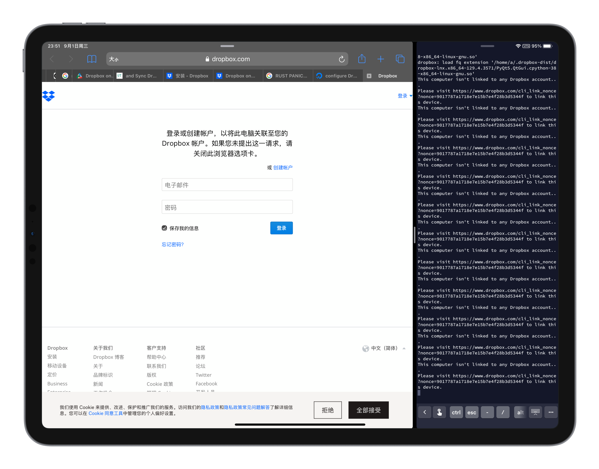

又进入了新的一月，又到了服务器续费的时候。由于我前些天把我的 travel blog 变成静态页面了，因此原本 serve 了它一段时间的服务器也可以注销掉了，不过服务器上还存有一些需要保留的文件，于是今天想把这些文件放到 Dropbox 中。

参照 [官方安装页面](https://www.dropbox.com/install-linux)，先运行以下命令下载并解压 Dropbox。

```shell
$ cd ~ && wget -O - "https://www.dropbox.com/download?plat=lnx.x86_64" | tar xzf -
```

然后在 home 目录就会产生一个 `.dropbox-dist` 目录，同样参照以上官方安装页面，运行这个目录下的 `dropboxd` 来启动 Dropbox 守护进程。

```
$ ~/.dropbox-dist/dropboxd
```

我在运行这句命令之后这段程序执行了一些指令后报错。（我使用的是 Ubuntu 20.04 LTS）


于是立马在 [DigitalOcean](https://www.digitalocean.com/community/questions/how-to-configure-dropbox-on-ubuntu-20-04) 中找到答案，我缺少了一些依赖，运行以下命令解决此问题。

```shell
$ sudo apt install libc6 libglapi-mesa libxdamage1 libxfixes3 libxcb-glx0 libxcb-dri2-0 libxcb-dri3-0 libxcb-present0 libxcb-sync1 libxshmfence1 libxxf86vm1
```

安装依赖后，运行上述命令，得到以下输出：


根据提示需要打开 URL 登录自己的账号以绑定这台服务器。打开后界面如下。



> 如果自己的 Dropbox 账号是通过 Google 或者 Apple 登录的话，需要先登录自己的账号设置一个密码才能在这里登录。

登录之后，控制台会出现一句话，

```
This computer is now linked to Dropbox. Welcome XXX
```

代表登录已经成功了。

此时 home 目录下已经出现了 `Dropbox` 目录，进入之后就可以看见自己 Dropbox 内部存放的文件。


依照官方安装页面，可以通过下载一个 Python 脚本，可以更方便地用命令行控制 Dropbox。运行以下命令[^1]来下载 Python 脚本到 `/usr/local/bin` 目录，即可快速执行。

```shell
$ sudo wget -O /usr/local/bin/dropbox "https://www.dropbox.com/download?dl=packages/dropbox.py"
```

再给它添加执行权限。

```shell
$ sudo chmod +x /usr/local/bin/dropbox
```

然后运行 `dropbox` 命令即可。


运行 `dropbox start` 启动守护进程。`dropbox status` 查看状态[^2]。

当操作 `Dropbox` 目录时，守护进程会将更新的内容自动同步至 Dropbox 云端。


在其他设备上也能看到同步的文件。


[^1]: https://linoxide.com/install-dropbox-ubuntu/
[^2]: https://help.dropbox.com/zh-cn/installs-integrations/desktop/linux-commands