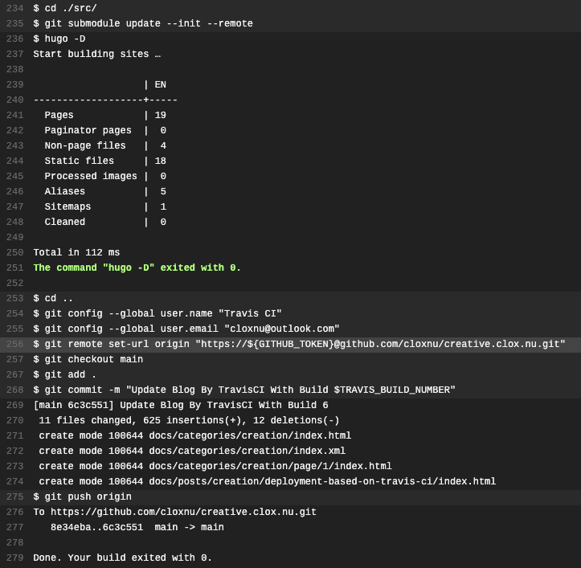

在 GitHub 仓库内创建 `.travis.yml` 文件并添加以下内容后，即可自动部署此 Hugo 站点。

```yaml
dist: bionic
addons:
  snaps:
    - hugo

install:
  - cd ./src/
  - git submodule update --init --remote

script:
  - hugo -D

after_script:
  - cd ..
  - git config --global user.name "Travis CI"
  - git config --global user.email <your-email>
  - git remote set-url origin "https://${GITHUB_TOKEN}@github.com/<username>/<repo-name>.git"
  - git checkout main
  - git add .
  - git commit -m "Update Blog By TravisCI With Build $TRAVIS_BUILD_NUMBER"
  - git push origin
```

> - 记得在 [travis-ci.com](https://travis-ci.com) 网站内添加 `GITHUB_TOKEN` 键值，以确认 `git push` 能正常运行。
> - `install` 内的 `cd ./src/` 是针对当前仓库的源码是存于 `src` 文件夹内，而 `after_script` 中的 `cd ..` 是返回根目录的做法。

travis job log:


