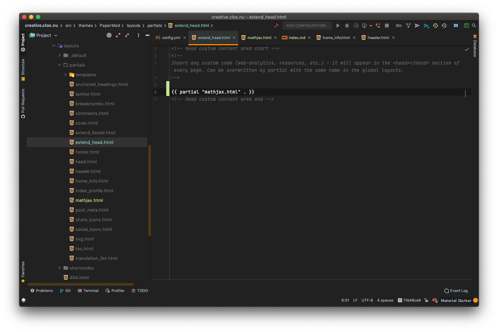

本站使用 Hugo 搭建而成，theme 主要使用 PaperMod，将源仓库 [adityatelange / hugo-PaperMod](https://github.com/adityatelange/hugo-PaperMod) fork 到自己的 GitHub 仓库 [cloxnu / hugo-PaperMod](https://github.com/cloxnu/hugo-PaperMod) 并手动增加Mathjax 特性后，本站仓库主题使用 git submodule 拉取。

以下添加 Mathjax 特性过程参考 [https://note.qidong.name/2018/03/hugo-mathjax/](https://note.qidong.name/2018/03/hugo-mathjax/)

手动添加文件 `layouts/partials/mathjax.html`


在 `partials` 目录下的文件 `extend_head.html` 添加代码



即可。

## 顺便在这里提一下 `git submodule` 和 `git remote`

在我 fork 了源仓库之后，使用命令

```shell
git remote add upstream https://github.com/adityatelange/hugo-PaperMod.git
```

来配置一个 remote，参考 [Configuring a remote for a fork](https://docs.github.com/en/github/collaborating-with-issues-and-pull-requests/configuring-a-remote-for-a-fork) ，并使用

```shell
git fetch upstream
```

来同步远程仓库，参考 [Syncing a fork](https://docs.github.com/en/github/collaborating-with-issues-and-pull-requests/syncing-a-fork) 。将 Mathjax 特性添加之后，push 到自己 fork 的仓库，随后在本站仓库使用命令

```shell
git submodule add https://github.com/cloxnu/hugo-PaperMod themes/PaperMod
git submodule init
git submodule update --remote
```

即可更新新的带有 Mathjax 特性的 PaperMod 主题了。

