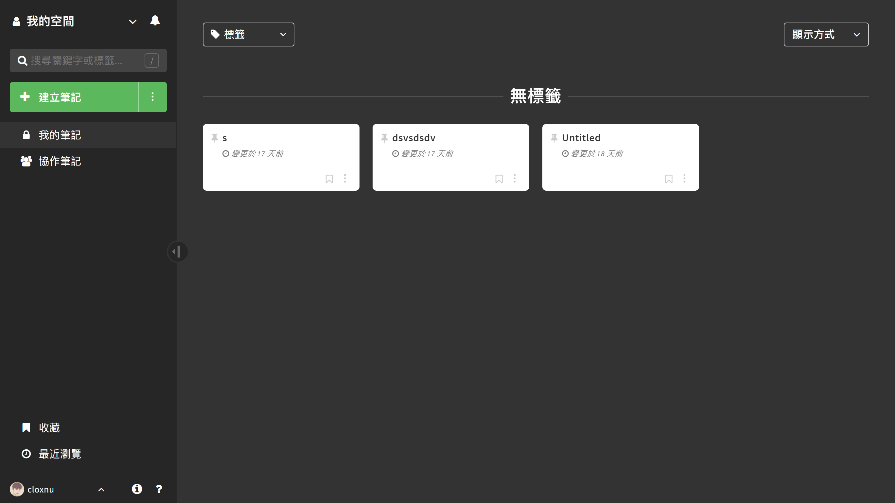
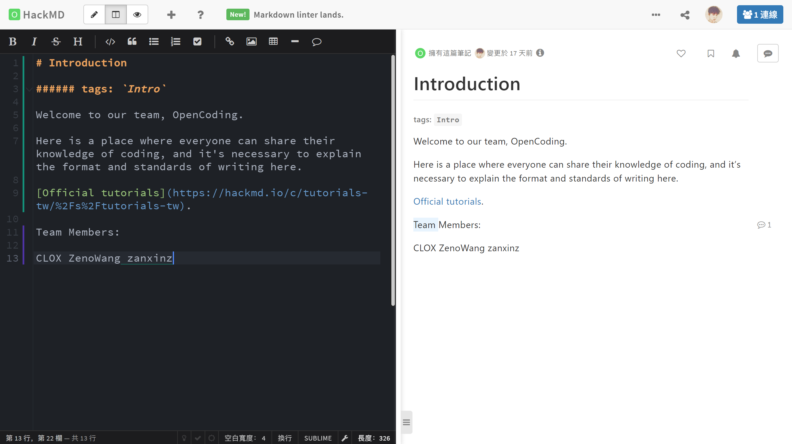
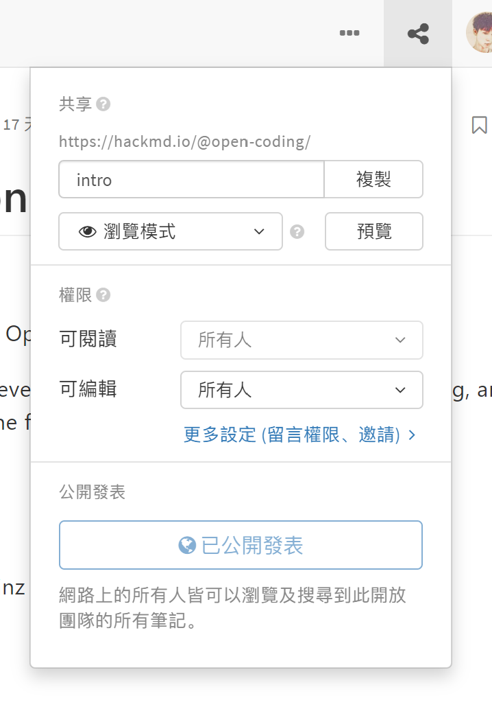
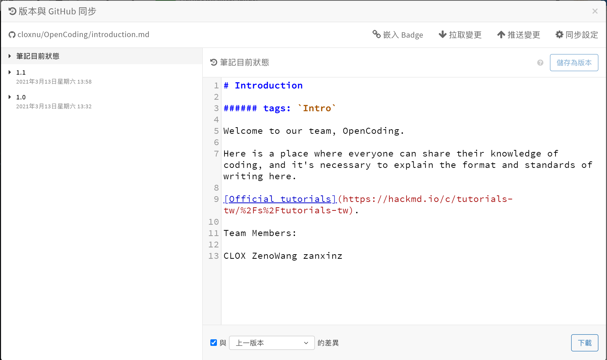

本文来自生产力 [ℙ𝕣𝕠𝕕𝕦𝕔𝕥𝕚𝕧𝕚𝕥𝕪](/posts/productivity/) 系列文章。

---

说到 Markdown 团队协作，就不得不提到 [HackMD](https://hackmd.io/)。

我有一段时间在寻找 Markdown 合作 & 同步的过程中，偶然间发现了 HackMD，当时使用了一下，意外地发现相当好用。

HackMD 支持 MathJax 公式，以下是官方宣传的特色功能：（当时觉得这正是我想要的）

注册账号登录以后，在个人页面可以建立不同的空间，给不同的文件放置不同的标签。这里的标签就已经起到了分类的作用，所以 HackMD 没有「文件夹」。

我立马新建了一个团队空间，新建了一个新的笔记，写作页面相当干净简洁，该有的功能都有。

在团队协作方面，正在编辑这篇文章的人可以同时看见其他协作者正在编辑的位置，编辑一段文字后还可以看见这段文字是谁写的，不同作者用不同颜色表示在这段文字的左边或者下面，如上图编辑页面。

在「共享」弹窗中还可以修改阅读或编辑这篇文章的权限，URL 以及浏览方式。

另外，GitHub 同步只能绑定一个 GitHub 账号的其中一个仓库中的一个文件，这样每次新建一个文件就得手动在 GitHub 新建一个文件了，如果它可以自动同步并且不同账号可以同步不同 GitHub 账号就好了。

HackMD 还有大量的功能与操作，这是 [官方文档](https://hackmd.io/c/tutorials-tw/%2Fs%2Ftutorials-tw)。
