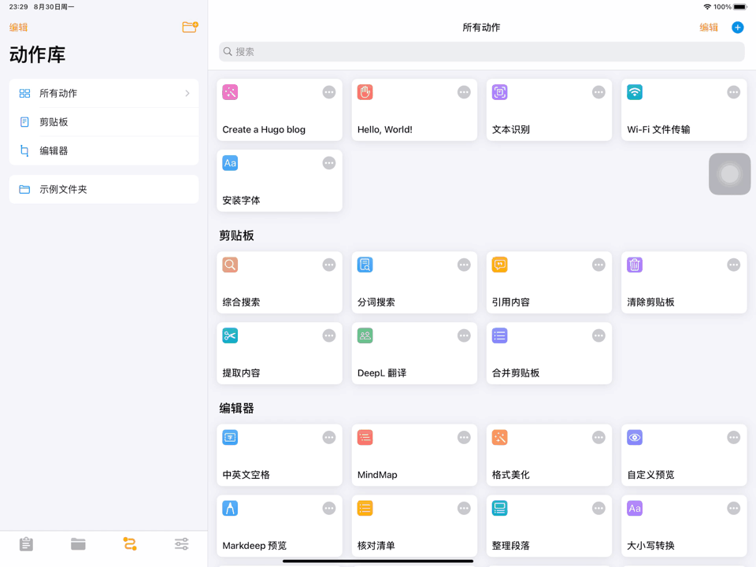

本文来自生产力 [ℙ𝕣𝕠𝕕𝕦𝕔𝕥𝕚𝕧𝕚𝕥𝕪](/posts/productivity/) 系列文章。

---

我们知道，在一台安装了 Hugo 命令行工具的电脑上，只需运行命令

```shell
$ hugo new ...
```

即可创建一个新的 blog。

为了发挥 iPad Pro 的「生产力」属性，我使用 Taio 的「动作」实现了此命令，因此可以在 iPad Pro 上高效快速地撰写 blog。

首先使用「Working Copy」拉取 GitHub 上的 blog 远程仓库。


然后打开 Taio，将刚刚拉取下来的远程仓库的本地地址添加到 Taio 的「添加的位置」中。


添加完成后，在「动作库」中创建新动作，取名叫「Create a Hugo blog」。


以下是一个创建新 blog 的简单版本，运行之后会要求输入 blog 目录名，标题，以及类别，然后会在当前目录下创建这个目录，以及这个目录下的 `index.md`。

PS：这里添加到 blog 的当前日期符合 ISO 8601 标准，时间格式为 `yyyy-MM-dd'T'HH:mm:ssxxx`


然后将写好的动作拖移到「编辑器」文件夹中，意味着可以在编辑器的快捷动作里运行。



在某一分类文件夹下的任意文件里，点击右上角的闪电标志，运行「Create a Hugo blog」即可。


使用 Taio 写完整篇文章后，最终回到「Working Copy」，Commit & Push 自己的更改。剩下生成 HTML 的环节就交给 Travis CI 或者 GitHub Actions 去完成，详细配置请看 [使用 Travis CI 自动部署 Hugo 站点](/posts/creation/deployment-based-on-travis-ci/)

PS：如果你的 GitHub 账号拥有 GitHub Student Developer Pack，则可以不需要为「Working Copy」购买 Pro。

本文使用 Taio 编辑，且仅使用 iPad Pro 进行发布。