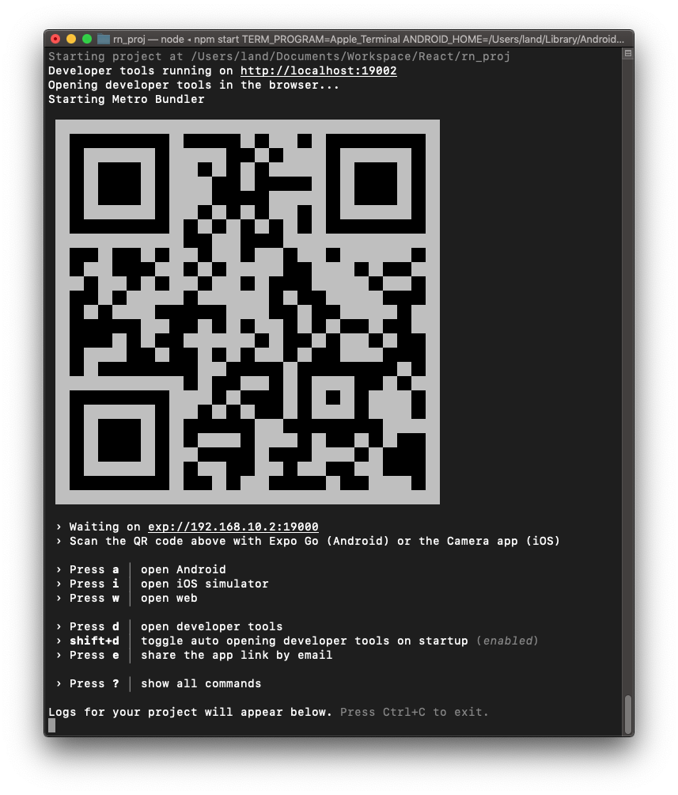
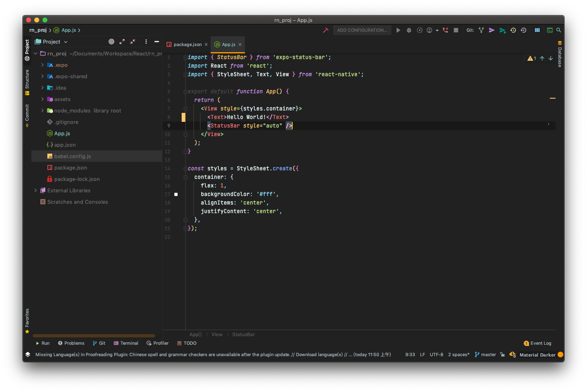

## 安装

由于开发需要，稍稍玩了玩 React Native 开发一个 App 的简要流程。

[官网](https://reactnative.dev/)

安装使用时，可以使用 [Expo](https://expo.io/) ，可以省去在 Xcode 或者 Android Studio 配置的过程。

在 macOS 上，运行以下命令安装 Expo

```shell
npm install -g expo-cli
```

注意这里在 `npm` 前不要加 `sudo`，请提前确保权限通顺

```shell
sudo chown -R $(whoami) ~/.npm
sudo chown -R $(whoami) /usr/local/lib/node_modules
```

安装好后，我试图运行 Expo，但是得到了 Expo 不支持当前的 Node 版本的错误，于是运行 `nvm` 来安装最新版本 Node（以下是未安装 `nvm` 的版本）：

```shell
sudo npm install -g n
sudo n latest
```

或者，使用 `yarn`

```shell
yarn global add expo-cli
```

## 开始

安装好后，生成第一个项目：

```shell
expo init rn_proj
```

进入目录并运行

```shell
cd rn_proj
expo start
```



然后在待调试的设备上下载 Expo Go 后扫码即可开始调试

将 `App.js` 中 `Text` 标签对里的内容改为 `Hello World!` 后



运行在 iPhone XR 真机上：


