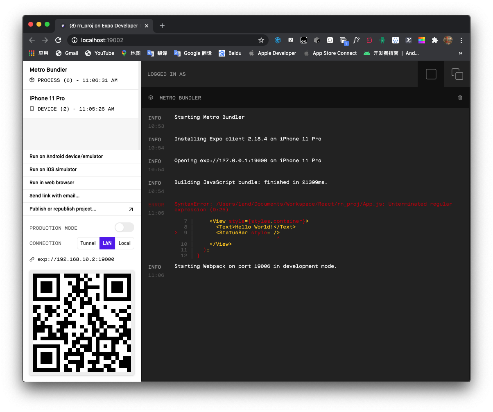

## 安装

由于开发需要，稍稍玩了玩 React Native 开发一个 App 的简要流程。

[官网](https://reactnative.dev/)

安装使用时，可以使用 [Expo](https://expo.io/) ，可以省去在 Xcode 或者 Android Studio 配置的过程。

我使用 macOS，运行以下命令安装 Expo

```shell
npm install -g expo-cli
```

注意这里在 `npm` 前不要加 `sudo`，请提前确保权限通顺

```shell
sudo chown -R $(whoami) ~/.npm
sudo chown -R $(whoami) /usr/local/lib/node_modules
```

安装好后，我试图运行 Expo，但是得到了 Expo 不支持当前的 Node 版本的错误，于是运行 `nvm` 来安装最新版本 Node（以下是未安装 `nvm` 的版本）：

```shell
sudo npm install -g n
sudo n latest
```

或者，使用 `yarn`

```shell
yarn global add expo-cli
```

## 开始

安装好后，生成第一个项目：

```shell
expo init rn_proj
```

进入目录并运行

```shell
cd rn_proj
expo start
```


然后同时会打开一个 Web 控制台



然后在待调试的设备上下载 Expo Go 后扫码即可开始调试

将 `App.js` 中 `Text` 标签对里的内容改为 `Hello World!` 后


运行在 iPhone XR 真机上：


### 模拟器运行

这里我弄了好久一直卡在安装 Expo Go 到模拟器中，看到网络流量情况才发现下载一直没有用代理，macOS 需要开启终端代理才可。

```shell
export https_proxy=http://127.0.0.1:7890 http_proxy=http://127.0.0.1:7890 all_proxy=socks5://127.0.0.1:7890
```

这里的端口需要设置为代理的端口，我使用的 Clash 可以自动生成终端代理命令。


### 运行于 Web


> 写代码时每当修改保存，只要当前还处于 `expo start` 状态，真机或模拟器上的画面就会跟着改变

## 或者直接使用 React Native

```shell
npx react-native init rn_proj
```

或

```shell
yarn react-native init rn_proj
```

> 国内访问记得设置代理
> ```shell
> npm config set proxy=http://127.0.0.1:xxxx
> ```

