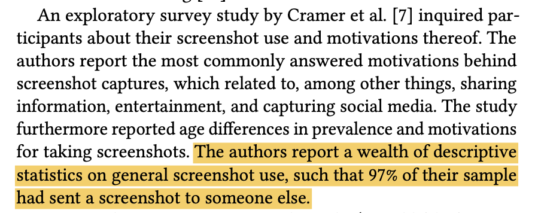
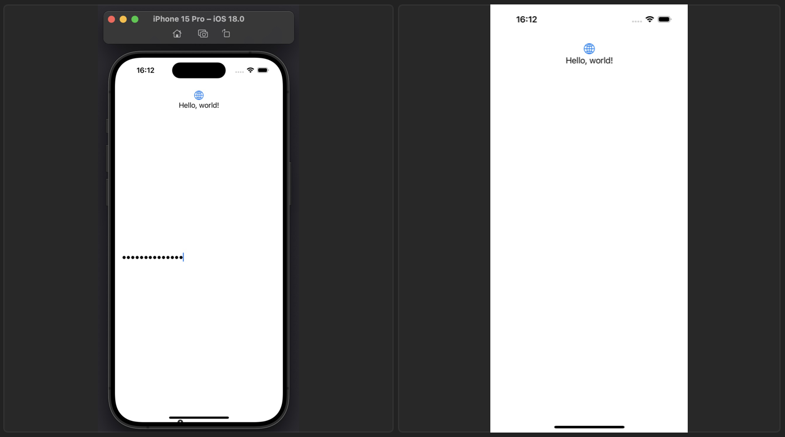
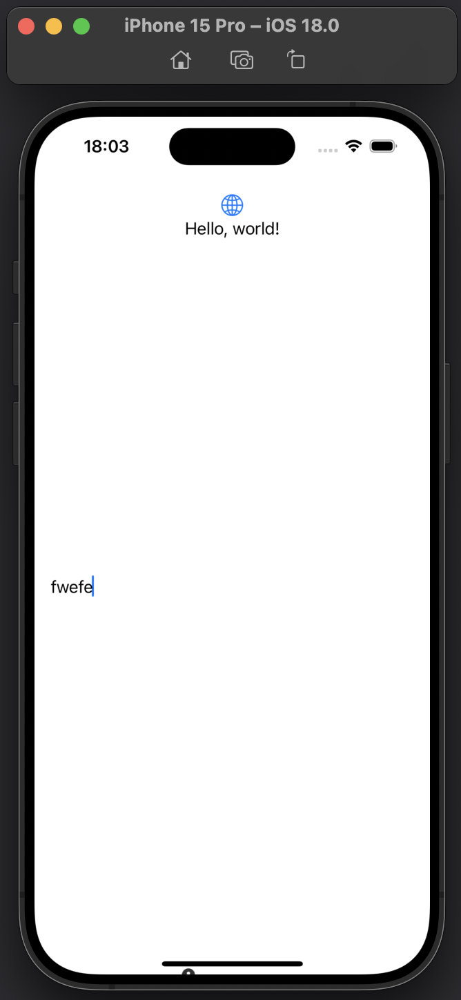
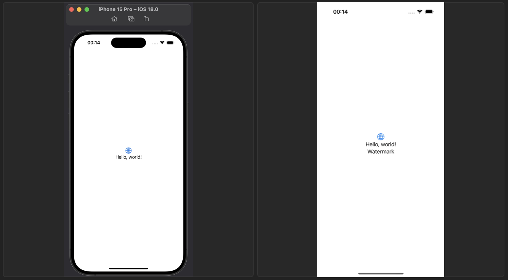

## 背景

在现代数字交流中，屏幕截图成为一种常见的工具，不仅用于记录和保存内容，还广泛用于分享信息。一篇题为《Why do people take Screenshots on their Smartphones?》[1] 的研究论文指出，有97%的受访者曾将截图发送给他人。这一数据表明，屏幕截图不仅仅是个人记录的手段，更是一种重要的社交互动方式。通过截图，用户能够快速分享对话、通知或有用的内容，从而在信息传播和交流中发挥关键作用。



然而，对于这样高比例的分享行为，用户可能的目的有：

- 认为当前屏幕的内容有趣，想要分享给其他人；
- 认为当前屏幕的内容不符合预期，想要反馈给开发者；

于是，我们可以从中做出这些事：

- 在用户截图时将品牌 logo 放置在不影响其他内容的地方，提高品牌宣传力；
- 将屏幕截图中的敏感信息隐藏起来，防止这些内容暴露给其他人，保护用户隐私；
- 在隐私协议允许范围内将诊断信息隐藏在截图中，从而更好地优化产品可能遇到的问题；

因此，接下来我们将开始研究实现方式。

## 使用 mask 隐藏 / 显示信息

本质上来讲，我们如果做到了可以在截屏时隐藏信息，那也就同样做到了显示信息，我们可以通过隐藏 / 显示蒙板的内容来控制实际内容的显示。对于 SwiftUI，有以下代码：

```swift
content
    .mask {
        ZStack {
            Color.white
            HideWhenTakingScreenshot {
                Color.black
            }
        }
        .compositingGroup()
        .luminanceToAlpha()
    }
```

假设我们已经实现了 `HideWhenTakingScreenshot` 中的内容，在屏幕截图时隐藏 `Color.black` ，对于 `content` ，也就相当于在屏幕截图时显示了，UIKit 同理。

## 在屏幕截图时隐藏信息

经过层层过滤，其实我们的真实需求是如何在屏幕截图时隐藏信息。

### `UITextField` 的神奇作用

说到隐私保护，我们不得不想起当用户在密码框中输入密码时作为 iOS 系统级的保护，他会在用户截屏时自动隐藏密码输入框，如以下代码所示：

```swift
struct PasswordTextView: UIViewRepresentable {
    @Binding var password: String?
    
    func makeUIView(context: Context) -> UITextField {
        let textField = UITextField()
        textField.isSecureTextEntry = true
        return textField
    }
    
    func updateUIView(_ uiView: UITextField, context: Context) {
        uiView.text = password
    }
}
```

这是一个最简单的用 UIKit 实现的密码框，可以将这个 `PasswordTextView` 添加到 SwiftUI 视图中，于是我们发现，当输入一些密码后并截图，密码框会在截图中消失不见。



那么这是如何做到的呢？我意识到一定是 `isSecureTextEntry` 这个属性在作祟，因为只要去掉这一行，截图消失这一效果将不再起作用。

于是我们可以使用 LLDB 命令找到 `setSecureTextEntry:` 这个方法调用的具体位置。

```swift
(lldb) image lookup -n "-[UITextField setSecureTextEntry:]"
1 match found in /Library/Developer/CoreSimulator/Volumes/iOS_22A5297f/Library/Developer/CoreSimulator/Profiles/Runtimes/iOS 18.0.simruntime/Contents/Resources/RuntimeRoot/System/Library/PrivateFrameworks/UIKitCore.framework/UIKitCore:
        Address: UIKitCore[0x00000000011406bc] (UIKitCore.__TEXT.__text + 18073272)
        Summary: UIKitCore`-[UITextField setSecureTextEntry:]
```

看起来这发生在 `UIKitCore.framework` ，将这个文件在反编译软件里进行反编译后，并找到 `-[UITextField setSecureTextEntry:]` ，于是得到这个方法实现的伪代码：

```swift
/* @class UITextField */
-(int)setSecureTextEntry:(int)arg2 {
    r2 = arg2;
    r1 = arg1;
    r31 = r31 - 0x30;
    var_10 = r20;
    stack[-24] = r19;
    saved_fp = r29;
    stack[-8] = r30;
    r20 = r2;
    r19 = arg0;
    [arg0 textInputTraits];
    r0 = loc_18c2b3a10();
    var_18 = r0;
    if ([r0 isSecureTextEntry] != r20) {
            r2 = r20;
            [var_18 setSecureTextEntry:r2];
            [r19 _didChangeSecureTextEntry];
    }
    r0 = var_18;
    if (((stack[-8] ^ stack[-8] * 0x2) & 0x40000000) != 0x0) {
            asm { brk        #0xc471 };
            r0 = loc_1868d24b4(r0, r1, r2);
    }
    else {
            r0 = loc_18c2b3bb0();
    }
    return r0;
}
```

从这段伪代码中可以看出，其中最具嫌疑的是 17 行的 `[var_18 setSecureTextEntry:r2];` 和 18 行的 `[r19 _didChangeSecureTextEntry];` ，我们可以先排除 18 行的影响。因我们已知 11 行 `r19 = arg0` 即汇编代码中 `mov x19, x0` ，所以这里的 `r19` 相当于当前 `UITextField` 实例。故这一行实际是在调用 `[UITextField _didChangeSecureTextEntry]` 。于是我们在这行打上断点：

```shell
(lldb) b -[UITextField _didChangeSecureTextEntry]
Breakpoint 1: where = UIKitCore`-[UITextField _didChangeSecureTextEntry], address = 0x0000000185d95714
```

运行代码，直到程序停在断点位置，随后使用命令：

```shell
(lldb) thread return
```

直接返回当前函数。然后继续运行代码，我们可以看到文本框的密码特性将不再生效，截图也不再隐藏，于是我们断定具体生效位置是在 `[UITextField _didChangeSecureTextEntry]` 内部。



### 证明

在源代码中我们使用 Objective-C 定义 `SWTextField` ，继承 `UITextField` ，声明 `_didChangeSecureTextEntry` 并覆写 `isSecureTextEntry` get 方法：

```objectivec
@interface SWTextField : UITextField

- (void)_didChangeSecureTextEntry;

@end

@implementation SWTextField

- (BOOL)isSecureTextEntry {
    return YES;
}

@end
```

然后将 `PasswordTextView` 改成：

```swift
struct PasswordTextView: UIViewRepresentable {
    @Binding var password: String?
    
    func makeUIView(context: Context) -> UITextField {
        let textField = SWTextField()
        textField._didChangeSecureTextEntry()
        return textField
    }
    
    func updateUIView(_ uiView: UITextField, context: Context) {
        uiView.text = password
    }
}
```

即可看到能够证明 `_didChangeSecureTextEntry` 方法是有效的。

### Dive into `[UITextField _didChangeSecureTextEntry]`

回到断点 `[UITextField _didChangeSecureTextEntry`，我们可以在 Xcode 中看到：

```objectivec
UIKitCore`-[UITextField _didChangeSecureTextEntry]:
    0x185d95714 <+0>:   sub    sp, sp, #0x50
    0x185d95718 <+4>:   stp    x24, x23, [sp, #0x10]
    0x185d9571c <+8>:   stp    x22, x21, [sp, #0x20]
    0x185d95720 <+12>:  stp    x20, x19, [sp, #0x30]
    0x185d95724 <+16>:  stp    x29, x30, [sp, #0x40]
    0x185d95728 <+20>:  add    x29, sp, #0x40
    0x185d9572c <+24>:  mov    x19, x0
    0x185d95730 <+28>:  bl     0x1867a1ac0               ; objc_msgSend$_setNeedsStyleRecalc
    0x185d95734 <+32>:  mov    x0, x19
    0x185d95738 <+36>:  bl     0x1867acb20               ; objc_msgSend$_shouldObscureInput
    0x185d9573c <+40>:  mov    x20, x0
    0x185d95740 <+44>:  adrp   x22, 417875
    0x185d95744 <+48>:  add    x22, x22, #0xa48          ; _MergedGlobals + 132
    0x185d95748 <+52>:  ldrsw  x8, [x22, #0x40]
    0x185d9574c <+56>:  ldr    x0, [x19, x8]
    0x185d95750 <+60>:  mov    x2, x20
    0x185d95754 <+64>:  bl     0x18688aae0               ; objc_msgSend$setDocumentObscured:
    0x185d95758 <+68>:  mov    x0, x19
    0x185d9575c <+72>:  bl     0x18675d0a0               ; objc_msgSend$_fieldEditor
    0x185d95760 <+76>:  bl     0x18607f9d0               ; symbol stub for: objc_claimAutoreleasedReturnValue
    0x185d95764 <+80>:  mov    x21, x0
    0x185d95768 <+84>:  mov    x0, x19
    0x185d9576c <+88>:  bl     0x18683da20               ; objc_msgSend$isSecureTextEntry
    0x185d95770 <+92>:  mov    x2, x0
    0x185d95774 <+96>:  mov    x0, x21
    0x185d95778 <+100>: bl     0x1868a9e20               ; objc_msgSend$setSecureTextEntry:
    0x185d9577c <+104>: bl     0x18607fb50               ; symbol stub for: objc_release_x21
    0x185d95780 <+108>: mov    w8, #0x12                 ; =18 
    0x185d95784 <+112>: cmp    w20, #0x0
    0x185d95788 <+116>: csel   w21, w8, wzr, ne
    0x185d9578c <+120>: ldrsw  x8, [x22]
    0x185d95790 <+124>: ldr    x0, [x19, x8]
->  0x185d95794 <+128>: bl     0x186844600               ; objc_msgSend$layer
    0x185d95798 <+132>: bl     0x18607f9d0               ; symbol stub for: objc_claimAutoreleasedReturnValue
    0x185d9579c <+136>: mov    x22, x0
    0x185d957a0 <+140>: mov    x2, x21
    0x185d957a4 <+144>: bl     0x186889ba0               ; objc_msgSend$setDisableUpdateMask:
    0x185d957a8 <+148>: bl     0x18607fb5c               ; symbol stub for: objc_release_x22
    0x185d957ac <+152>: adrp   x24, 371432
    0x185d957b0 <+156>: ldr    x0, [x24, #0x6d8]
    0x185d957b4 <+160>: bl     0x1867d0b80               ; objc_msgSend$activeInstance
    0x185d957b8 <+164>: bl     0x18607f9d0               ; symbol stub for: objc_claimAutoreleasedReturnValue
    0x185d957bc <+168>: mov    x21, x0
    0x185d957c0 <+172>: bl     0x186833120               ; objc_msgSend$inputDelegateManager
    0x185d957c4 <+176>: bl     0x18607f9d0               ; symbol stub for: objc_claimAutoreleasedReturnValue
    0x185d957c8 <+180>: mov    x22, x0
    0x185d957cc <+184>: bl     0x186840c00               ; objc_msgSend$keyInputDelegate
    0x185d957d0 <+188>: bl     0x18607f9d0               ; symbol stub for: objc_claimAutoreleasedReturnValue
    0x185d957d4 <+192>: mov    x23, x0
    0x185d957d8 <+196>: bl     0x18607fb68               ; symbol stub for: objc_release_x23
    0x185d957dc <+200>: bl     0x18607fb5c               ; symbol stub for: objc_release_x22
    0x185d957e0 <+204>: bl     0x18607fb50               ; symbol stub for: objc_release_x21
    0x185d957e4 <+208>: cmp    x23, x19
    0x185d957e8 <+212>: b.ne   0x185d95808               ; <+244>
    0x185d957ec <+216>: ldr    x0, [x24, #0x6d8]
    0x185d957f0 <+220>: bl     0x1867d0b80               ; objc_msgSend$activeInstance
    0x185d957f4 <+224>: bl     0x18607f9d0               ; symbol stub for: objc_claimAutoreleasedReturnValue
    0x185d957f8 <+228>: mov    x21, x0
    0x185d957fc <+232>: mov    x2, x19
    0x185d95800 <+236>: bl     0x186888640               ; objc_msgSend$setDelegate:
    0x185d95804 <+240>: bl     0x18607fb50               ; symbol stub for: objc_release_x21
    0x185d95808 <+244>: adrp   x8, 371433
    0x185d9580c <+248>: ldr    x21, [x8, #0x398]
    0x185d95810 <+252>: mov    x0, x19
    0x185d95814 <+256>: bl     0x186878b60               ; objc_msgSend$semanticContentAttribute
    0x185d95818 <+260>: mov    x2, x0
    0x185d9581c <+264>: mov    x0, x21
    0x185d95820 <+268>: bl     0x1868e3b40               ; objc_msgSend$userInterfaceLayoutDirectionForSemanticContentAttribute:
    0x185d95824 <+272>: cmp    x0, #0x1
    0x185d95828 <+276>: b.ne   0x185d95848               ; <+308>
    0x185d9582c <+280>: mov    x0, x19
    0x185d95830 <+284>: bl     0x1868d07c0               ; objc_msgSend$textAlignment
    0x185d95834 <+288>: cmp    x0, #0x4
    0x185d95838 <+292>: b.ne   0x185d95848               ; <+308>
    0x185d9583c <+296>: mov    x0, x19
    0x185d95840 <+300>: mov    w2, #0x2                  ; =2 
    0x185d95844 <+304>: bl     0x1868b1ba0               ; objc_msgSend$setTextAlignment:
    0x185d95848 <+308>: cbz    w20, 0x185d95860          ; <+332>
    0x185d9584c <+312>: mov    x0, x19
    0x185d95850 <+316>: bl     0x1868786c0               ; objc_msgSend$selectionRange
    0x185d95854 <+320>: cbz    x1, 0x185d95860           ; <+332>
    0x185d95858 <+324>: mov    x0, x19
    0x185d9585c <+328>: bl     0x186876fc0               ; objc_msgSend$selectAll
    0x185d95860 <+332>: mov    x0, x19
    0x185d95864 <+336>: bl     0x1868359e0               ; objc_msgSend$interactionAssistant
    0x185d95868 <+340>: bl     0x18607f9d0               ; symbol stub for: objc_claimAutoreleasedReturnValue
    0x185d9586c <+344>: str    x0, [sp, #0x8]
    0x185d95870 <+348>: bl     0x1868de180               ; objc_msgSend$updateDisplayedSelection
    0x185d95874 <+352>: ldr    x0, [sp, #0x8]
    0x185d95878 <+356>: ldp    x29, x30, [sp, #0x40]
    0x185d9587c <+360>: ldp    x20, x19, [sp, #0x30]
    0x185d95880 <+364>: ldp    x22, x21, [sp, #0x20]
    0x185d95884 <+368>: ldp    x24, x23, [sp, #0x10]
    0x185d95888 <+372>: add    sp, sp, #0x50
    0x185d9588c <+376>: b      0x18607fb08               ; symbol stub for: objc_release
```

对于这段程序，有 3 处位置值得注意：

- 18行的 `setDocumentObsecured:`
- 27行的 `setSecureTextEntry:`
- 38行的 `setDisableUpdateMask:`

为了筛选这些代码是哪里真正有效，我们可以单步调试到这些行，然后使用命令

```swift
(lldb) thread return
```

跳过其后的代码，通过当前截屏是否正常生效来确定运行过的代码是否起作用。

无论我们定位到 18 行还是 27 行，在使用 `thread return` 命令后都会出现在密码输入框输入的文字是 "·"，而截屏后的这些字符并不会消失。直到第 38 行。

于是我们断点到第 38 行，输入命令

```swift
(lldb) po $x0
<CALayer:0x600000287100; position = CGPoint (0 0); bounds = CGRect (0 0; 0 0); delegate = <_UITextLayoutCanvasView: 0x111021eb0; frame = (0 0; 0 0); layer = <CALayer: 0x600000287100>>; opaque = YES; allowsGroupOpacity = YES; >
```

得知当前调用 `setDisableUpdateMask:` 是 `CALayer` 。然后再尝试断点第 34 行，并再次输入

```shell
(lldb) po $x0
<_UITextLayoutCanvasView: 0x106021100; frame = (0 0; 0 0); layer = <CALayer: 0x6000002884c0>>
```

得知对应 view 是 `_UITextLayoutCanvasView` ，并跟据反编译结果

```objectivec
[*(r19 + sign_extend_64(*(int32_t *)0x1e68ec204)) layer];
```

然后查找地址 `0x1e68ec204` 后，发现是原 `UITextField` 的一个子 view：`-[UITextField _textCanvasView]`。

因此我有一个大胆的猜测，只需调用任意 `CALayer` 的 `setDisableUpdateMask:` 方法即可在截屏隐藏当前 `CALayer` 的内容，其对应参数是存储在 x2 寄存器存储的值。而 x2 的值是在 29 行 `mov w8, #0x12` 赋值的。于是猜测该方法的参数是一个枚举值。在这里该值为 `0x12` 。

因此，给 `CALayer` 扩展该方法：

```objectivec
@interface CALayer ()

- (void)setDisableUpdateMask:(unsigned int)aValue;

@end
```

然后我们可以实现之前未完成的 `HideWhenTakingScreenshot` ，并给 `setDisableUpdateMask` 方法传入参数`0x12` ：

```swift
struct HideWhenTakingScreenshot: UIViewRepresentable {
    var color: UIColor = .black
    
    func makeUIView(context: Context) -> UIView {
        let view = UIView()
        view.layer.setDisableUpdateMask(0x12)
        return view
    }
    
    func updateUIView(_ uiView: UIView, context: Context) {
        uiView.backgroundColor = color
    }
}
```

最后，只需要将 `content` 实现为想要的效果即可，比如 `Text("Watermark")` ：

```swift
Text("Watermark")
    .mask {
        ZStack {
            Color.white
            HideWhenTakingScreenshot()
        }
        .compositingGroup()
        .luminanceToAlpha()
    }
```



----

[1]: [https://dl.acm.org/doi/abs/10.1145/3563657.3596067](https://dl.acm.org/doi/abs/10.1145/3563657.3596067)

